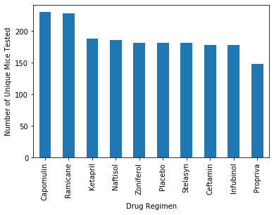
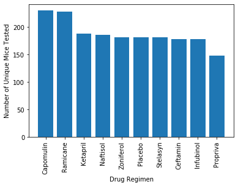
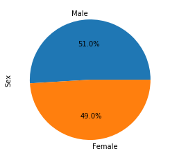
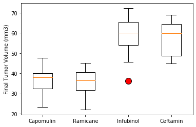
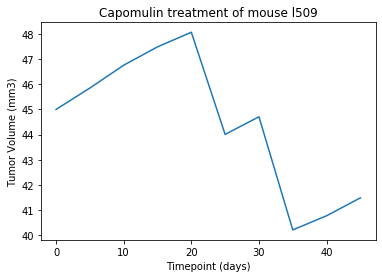
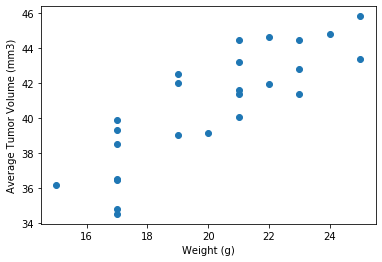
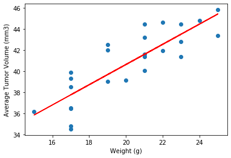

# Pymaceuticals Inc.
---

### Analysis
* Overall, it is clear that Capomulin is a viable drug regimen to reduce tumor growth.
* Capomulin had the most number of mice complete the study, with the exception of Remicane, all other regimens observed a number of mice deaths across the duration of the study. 
* There is a strong correlation between mouse weight and tumor volume, indicating that mouse weight may be contributing to the effectiveness of any drug regimen.
* There was one potential outlier within the Infubinol regimen. While most mice showed tumor volume increase, there was one mouse that had a reduction in tumor growth in the study. 


```python
# Dependencies and Setup
import matplotlib.pyplot as plt
import pandas as pd
import scipy.stats as st

# Study data files
mouse_metadata_path = "data/Mouse_metadata.csv"
study_results_path = "data/Study_results.csv"

# Read the mouse data and the study results
mouse_metadata = pd.read_csv(mouse_metadata_path)
study_results = pd.read_csv(study_results_path)

# Combine the data into a single dataset
study_data_complete = pd.merge(study_results, mouse_metadata, how="left", on="Mouse ID")

# Display the data table for preview
study_data_complete.head()
```


<div>
<style scoped>
    .dataframe tbody tr th:only-of-type {
        vertical-align: middle;
    }

    .dataframe tbody tr th {
        vertical-align: top;
    }

    .dataframe thead th {
        text-align: right;
    }
</style>
<table border="1" class="dataframe">
  <thead>
    <tr style="text-align: right;">
      <th></th>
      <th>Mouse ID</th>
      <th>Timepoint</th>
      <th>Tumor Volume (mm3)</th>
      <th>Metastatic Sites</th>
      <th>Drug Regimen</th>
      <th>Sex</th>
      <th>Age_months</th>
      <th>Weight (g)</th>
    </tr>
  </thead>
  <tbody>
    <tr>
      <td>0</td>
      <td>b128</td>
      <td>0</td>
      <td>45.0</td>
      <td>0</td>
      <td>Capomulin</td>
      <td>Female</td>
      <td>9</td>
      <td>22</td>
    </tr>
    <tr>
      <td>1</td>
      <td>f932</td>
      <td>0</td>
      <td>45.0</td>
      <td>0</td>
      <td>Ketapril</td>
      <td>Male</td>
      <td>15</td>
      <td>29</td>
    </tr>
    <tr>
      <td>2</td>
      <td>g107</td>
      <td>0</td>
      <td>45.0</td>
      <td>0</td>
      <td>Ketapril</td>
      <td>Female</td>
      <td>2</td>
      <td>29</td>
    </tr>
    <tr>
      <td>3</td>
      <td>a457</td>
      <td>0</td>
      <td>45.0</td>
      <td>0</td>
      <td>Ketapril</td>
      <td>Female</td>
      <td>11</td>
      <td>30</td>
    </tr>
    <tr>
      <td>4</td>
      <td>c819</td>
      <td>0</td>
      <td>45.0</td>
      <td>0</td>
      <td>Ketapril</td>
      <td>Male</td>
      <td>21</td>
      <td>25</td>
    </tr>
  </tbody>
</table>
</div>


```python
# Checking the number of mice.

```


    249


```python
# Getting the duplicate mice by ID number that shows up for Mouse ID and Timepoint. 

```


    array(['g989'], dtype=object)


```python
# Optional: Get all the data for the duplicate mouse ID. 

```


<div>
<style scoped>
    .dataframe tbody tr th:only-of-type {
        vertical-align: middle;
    }

    .dataframe tbody tr th {
        vertical-align: top;
    }

    .dataframe thead th {
        text-align: right;
    }
</style>
<table border="1" class="dataframe">
  <thead>
    <tr style="text-align: right;">
      <th></th>
      <th>Mouse ID</th>
      <th>Timepoint</th>
      <th>Tumor Volume (mm3)</th>
      <th>Metastatic Sites</th>
      <th>Drug Regimen</th>
      <th>Sex</th>
      <th>Age_months</th>
      <th>Weight (g)</th>
    </tr>
  </thead>
  <tbody>
    <tr>
      <td>107</td>
      <td>g989</td>
      <td>0</td>
      <td>45.000000</td>
      <td>0</td>
      <td>Propriva</td>
      <td>Female</td>
      <td>21</td>
      <td>26</td>
    </tr>
    <tr>
      <td>137</td>
      <td>g989</td>
      <td>0</td>
      <td>45.000000</td>
      <td>0</td>
      <td>Propriva</td>
      <td>Female</td>
      <td>21</td>
      <td>26</td>
    </tr>
    <tr>
      <td>329</td>
      <td>g989</td>
      <td>5</td>
      <td>48.786801</td>
      <td>0</td>
      <td>Propriva</td>
      <td>Female</td>
      <td>21</td>
      <td>26</td>
    </tr>
    <tr>
      <td>360</td>
      <td>g989</td>
      <td>5</td>
      <td>47.570392</td>
      <td>0</td>
      <td>Propriva</td>
      <td>Female</td>
      <td>21</td>
      <td>26</td>
    </tr>
    <tr>
      <td>620</td>
      <td>g989</td>
      <td>10</td>
      <td>51.745156</td>
      <td>0</td>
      <td>Propriva</td>
      <td>Female</td>
      <td>21</td>
      <td>26</td>
    </tr>
    <tr>
      <td>681</td>
      <td>g989</td>
      <td>10</td>
      <td>49.880528</td>
      <td>0</td>
      <td>Propriva</td>
      <td>Female</td>
      <td>21</td>
      <td>26</td>
    </tr>
    <tr>
      <td>815</td>
      <td>g989</td>
      <td>15</td>
      <td>51.325852</td>
      <td>1</td>
      <td>Propriva</td>
      <td>Female</td>
      <td>21</td>
      <td>26</td>
    </tr>
    <tr>
      <td>869</td>
      <td>g989</td>
      <td>15</td>
      <td>53.442020</td>
      <td>0</td>
      <td>Propriva</td>
      <td>Female</td>
      <td>21</td>
      <td>26</td>
    </tr>
    <tr>
      <td>950</td>
      <td>g989</td>
      <td>20</td>
      <td>55.326122</td>
      <td>1</td>
      <td>Propriva</td>
      <td>Female</td>
      <td>21</td>
      <td>26</td>
    </tr>
    <tr>
      <td>1111</td>
      <td>g989</td>
      <td>20</td>
      <td>54.657650</td>
      <td>1</td>
      <td>Propriva</td>
      <td>Female</td>
      <td>21</td>
      <td>26</td>
    </tr>
    <tr>
      <td>1195</td>
      <td>g989</td>
      <td>25</td>
      <td>56.045564</td>
      <td>1</td>
      <td>Propriva</td>
      <td>Female</td>
      <td>21</td>
      <td>26</td>
    </tr>
    <tr>
      <td>1380</td>
      <td>g989</td>
      <td>30</td>
      <td>59.082294</td>
      <td>1</td>
      <td>Propriva</td>
      <td>Female</td>
      <td>21</td>
      <td>26</td>
    </tr>
    <tr>
      <td>1592</td>
      <td>g989</td>
      <td>35</td>
      <td>62.570880</td>
      <td>2</td>
      <td>Propriva</td>
      <td>Female</td>
      <td>21</td>
      <td>26</td>
    </tr>
  </tbody>
</table>
</div>


```python
# Create a clean DataFrame by dropping the duplicate mouse by its ID.

```


<div>
<style scoped>
    .dataframe tbody tr th:only-of-type {
        vertical-align: middle;
    }

    .dataframe tbody tr th {
        vertical-align: top;
    }

    .dataframe thead th {
        text-align: right;
    }
</style>
<table border="1" class="dataframe">
  <thead>
    <tr style="text-align: right;">
      <th></th>
      <th>Mouse ID</th>
      <th>Timepoint</th>
      <th>Tumor Volume (mm3)</th>
      <th>Metastatic Sites</th>
      <th>Drug Regimen</th>
      <th>Sex</th>
      <th>Age_months</th>
      <th>Weight (g)</th>
    </tr>
  </thead>
  <tbody>
    <tr>
      <td>0</td>
      <td>b128</td>
      <td>0</td>
      <td>45.0</td>
      <td>0</td>
      <td>Capomulin</td>
      <td>Female</td>
      <td>9</td>
      <td>22</td>
    </tr>
    <tr>
      <td>1</td>
      <td>f932</td>
      <td>0</td>
      <td>45.0</td>
      <td>0</td>
      <td>Ketapril</td>
      <td>Male</td>
      <td>15</td>
      <td>29</td>
    </tr>
    <tr>
      <td>2</td>
      <td>g107</td>
      <td>0</td>
      <td>45.0</td>
      <td>0</td>
      <td>Ketapril</td>
      <td>Female</td>
      <td>2</td>
      <td>29</td>
    </tr>
    <tr>
      <td>3</td>
      <td>a457</td>
      <td>0</td>
      <td>45.0</td>
      <td>0</td>
      <td>Ketapril</td>
      <td>Female</td>
      <td>11</td>
      <td>30</td>
    </tr>
    <tr>
      <td>4</td>
      <td>c819</td>
      <td>0</td>
      <td>45.0</td>
      <td>0</td>
      <td>Ketapril</td>
      <td>Male</td>
      <td>21</td>
      <td>25</td>
    </tr>
  </tbody>
</table>
</div>


```python
# Checking the number of mice in the clean DataFrame.

```


    248


## Summary Statistics


```python
# Generate a summary statistics table of mean, median, variance, standard deviation, and SEM of the tumor volume for each regimen

# Use groupby and summary statistical methods to calculate the following properties of each drug regimen: 
# mean, median, variance, standard deviation, and SEM of the tumor volume. 
# Assemble the resulting series into a single summary dataframe.

summary_table
```


<div>
<style scoped>
    .dataframe tbody tr th:only-of-type {
        vertical-align: middle;
    }

    .dataframe tbody tr th {
        vertical-align: top;
    }

    .dataframe thead th {
        text-align: right;
    }
</style>
<table border="1" class="dataframe">
  <thead>
    <tr style="text-align: right;">
      <th></th>
      <th>Mean Tumor Volume</th>
      <th>Median Tumor Volume</th>
      <th>Tumor Volume Variance</th>
      <th>Tumor Volume Std. Dev.</th>
      <th>Tumor Volume Std. Err.</th>
    </tr>
    <tr>
      <th>Drug Regimen</th>
      <th></th>
      <th></th>
      <th></th>
      <th></th>
      <th></th>
    </tr>
  </thead>
  <tbody>
    <tr>
      <td>Capomulin</td>
      <td>40.675741</td>
      <td>41.557809</td>
      <td>24.947764</td>
      <td>4.994774</td>
      <td>0.329346</td>
    </tr>
    <tr>
      <td>Ceftamin</td>
      <td>52.591172</td>
      <td>51.776157</td>
      <td>39.290177</td>
      <td>6.268188</td>
      <td>0.469821</td>
    </tr>
    <tr>
      <td>Infubinol</td>
      <td>52.884795</td>
      <td>51.820584</td>
      <td>43.128684</td>
      <td>6.567243</td>
      <td>0.492236</td>
    </tr>
    <tr>
      <td>Ketapril</td>
      <td>55.235638</td>
      <td>53.698743</td>
      <td>68.553577</td>
      <td>8.279709</td>
      <td>0.603860</td>
    </tr>
    <tr>
      <td>Naftisol</td>
      <td>54.331565</td>
      <td>52.509285</td>
      <td>66.173479</td>
      <td>8.134708</td>
      <td>0.596466</td>
    </tr>
    <tr>
      <td>Placebo</td>
      <td>54.033581</td>
      <td>52.288934</td>
      <td>61.168083</td>
      <td>7.821003</td>
      <td>0.581331</td>
    </tr>
    <tr>
      <td>Propriva</td>
      <td>52.320930</td>
      <td>50.446266</td>
      <td>43.852013</td>
      <td>6.622085</td>
      <td>0.544332</td>
    </tr>
    <tr>
      <td>Ramicane</td>
      <td>40.216745</td>
      <td>40.673236</td>
      <td>23.486704</td>
      <td>4.846308</td>
      <td>0.320955</td>
    </tr>
    <tr>
      <td>Stelasyn</td>
      <td>54.233149</td>
      <td>52.431737</td>
      <td>59.450562</td>
      <td>7.710419</td>
      <td>0.573111</td>
    </tr>
    <tr>
      <td>Zoniferol</td>
      <td>53.236507</td>
      <td>51.818479</td>
      <td>48.533355</td>
      <td>6.966589</td>
      <td>0.516398</td>
    </tr>
  </tbody>
</table>
</div>


```python
# Generate a summary statistics table of mean, median, variance, standard deviation, and SEM of the tumor volume for each regimen

# Using the aggregation method, produce the same summary statistics in a single line

```


<div>
<style scoped>
    .dataframe tbody tr th:only-of-type {
        vertical-align: middle;
    }

    .dataframe tbody tr th {
        vertical-align: top;
    }

    .dataframe thead tr th {
        text-align: left;
    }

    .dataframe thead tr:last-of-type th {
        text-align: right;
    }
</style>
<table border="1" class="dataframe">
  <thead>
    <tr>
      <th></th>
      <th colspan="5" halign="left">Tumor Volume (mm3)</th>
    </tr>
    <tr>
      <th></th>
      <th>mean</th>
      <th>median</th>
      <th>var</th>
      <th>std</th>
      <th>sem</th>
    </tr>
    <tr>
      <th>Drug Regimen</th>
      <th></th>
      <th></th>
      <th></th>
      <th></th>
      <th></th>
    </tr>
  </thead>
  <tbody>
    <tr>
      <td>Capomulin</td>
      <td>40.675741</td>
      <td>41.557809</td>
      <td>24.947764</td>
      <td>4.994774</td>
      <td>0.329346</td>
    </tr>
    <tr>
      <td>Ceftamin</td>
      <td>52.591172</td>
      <td>51.776157</td>
      <td>39.290177</td>
      <td>6.268188</td>
      <td>0.469821</td>
    </tr>
    <tr>
      <td>Infubinol</td>
      <td>52.884795</td>
      <td>51.820584</td>
      <td>43.128684</td>
      <td>6.567243</td>
      <td>0.492236</td>
    </tr>
    <tr>
      <td>Ketapril</td>
      <td>55.235638</td>
      <td>53.698743</td>
      <td>68.553577</td>
      <td>8.279709</td>
      <td>0.603860</td>
    </tr>
    <tr>
      <td>Naftisol</td>
      <td>54.331565</td>
      <td>52.509285</td>
      <td>66.173479</td>
      <td>8.134708</td>
      <td>0.596466</td>
    </tr>
    <tr>
      <td>Placebo</td>
      <td>54.033581</td>
      <td>52.288934</td>
      <td>61.168083</td>
      <td>7.821003</td>
      <td>0.581331</td>
    </tr>
    <tr>
      <td>Propriva</td>
      <td>52.320930</td>
      <td>50.446266</td>
      <td>43.852013</td>
      <td>6.622085</td>
      <td>0.544332</td>
    </tr>
    <tr>
      <td>Ramicane</td>
      <td>40.216745</td>
      <td>40.673236</td>
      <td>23.486704</td>
      <td>4.846308</td>
      <td>0.320955</td>
    </tr>
    <tr>
      <td>Stelasyn</td>
      <td>54.233149</td>
      <td>52.431737</td>
      <td>59.450562</td>
      <td>7.710419</td>
      <td>0.573111</td>
    </tr>
    <tr>
      <td>Zoniferol</td>
      <td>53.236507</td>
      <td>51.818479</td>
      <td>48.533355</td>
      <td>6.966589</td>
      <td>0.516398</td>
    </tr>
  </tbody>
</table>
</div>


## Bar and Pie Charts


```python
# Generate a bar plot showing the total number of unique mice tested on each drug regimen using pandas.

```





```python
# Generate a bar plot showing the total number of unqiue mice tested on each drug regimen using using pyplot.

```





```python
# Generate a pie plot showing the distribution of female versus male mice using pandas

```





```python
# Generate a pie plot showing the distribution of female versus male mice using pyplot

```


## Quartiles, Outliers and Boxplots


```python
# Calculate the final tumor volume of each mouse across four of the treatment regimens:  
# Capomulin, Ramicane, Infubinol, and Ceftamin

# Start by getting the last (greatest) timepoint for each mouse


# Merge this group df with the original dataframe to get the tumor volume at the last timepoint

```


```python
# Put treatments into a list for for loop (and later for plot labels)

# Create empty list to fill with tumor vol data (for plotting)

# Calculate the IQR and quantitatively determine if there are any potential outliers. 

```

    Capomulin's potential outliers: Series([], Name: Tumor Volume (mm3), dtype: float64)
    Ramicane's potential outliers: Series([], Name: Tumor Volume (mm3), dtype: float64)
    Infubinol's potential outliers: 31    36.321346
    Name: Tumor Volume (mm3), dtype: float64
    Ceftamin's potential outliers: Series([], Name: Tumor Volume (mm3), dtype: float64)
    


```python
# Generate a box plot of the final tumor volume of each mouse across four regimens of interest

```





## Line and Scatter Plots


```python
# Generate a line plot of tumor volume vs. time point for a mouse treated with Capomulin

```





```python
# Generate a scatter plot of average tumor volume vs. mouse weight for the Capomulin regimen

```





## Correlation and Regression


```python
# Calculate the correlation coefficient and linear regression model 
# for mouse weight and average tumor volume for the Capomulin regimen

```

    The correlation between mouse weight and the average tumor volume is 0.84
    




